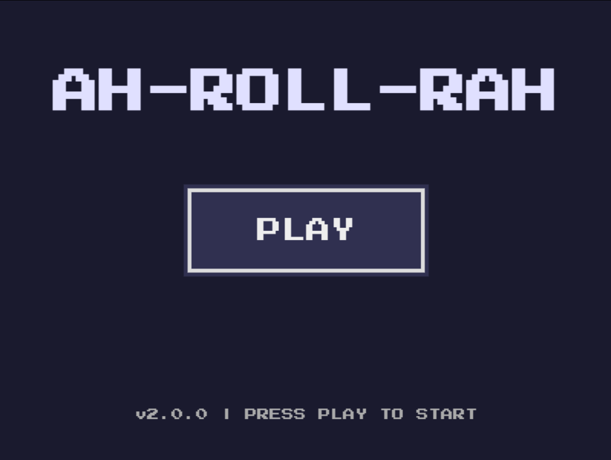
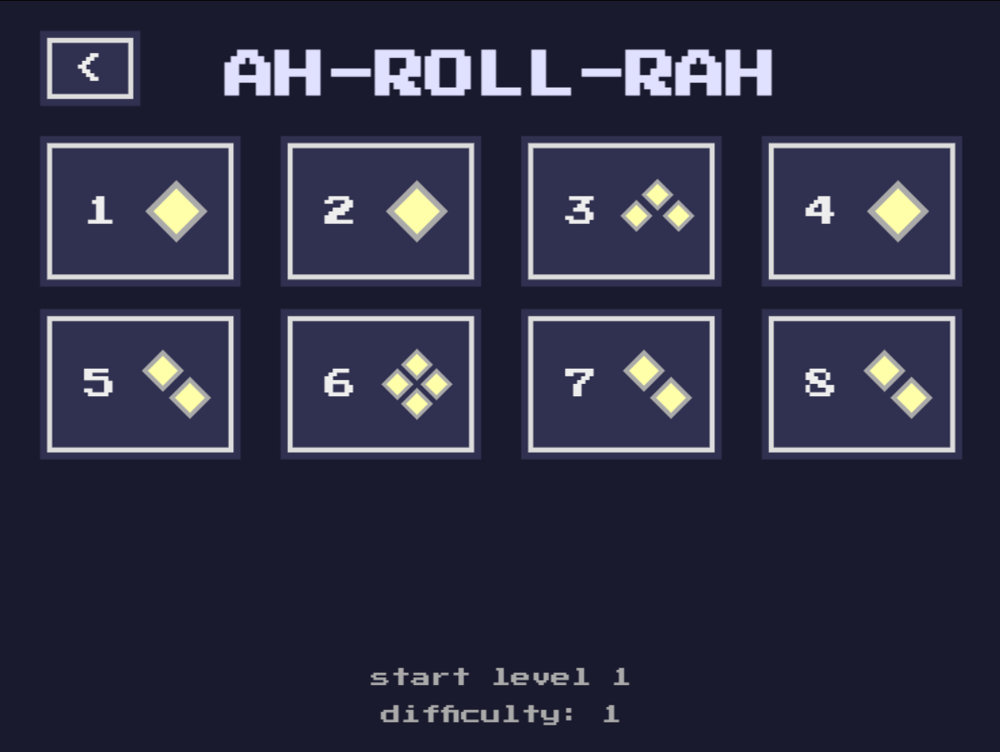
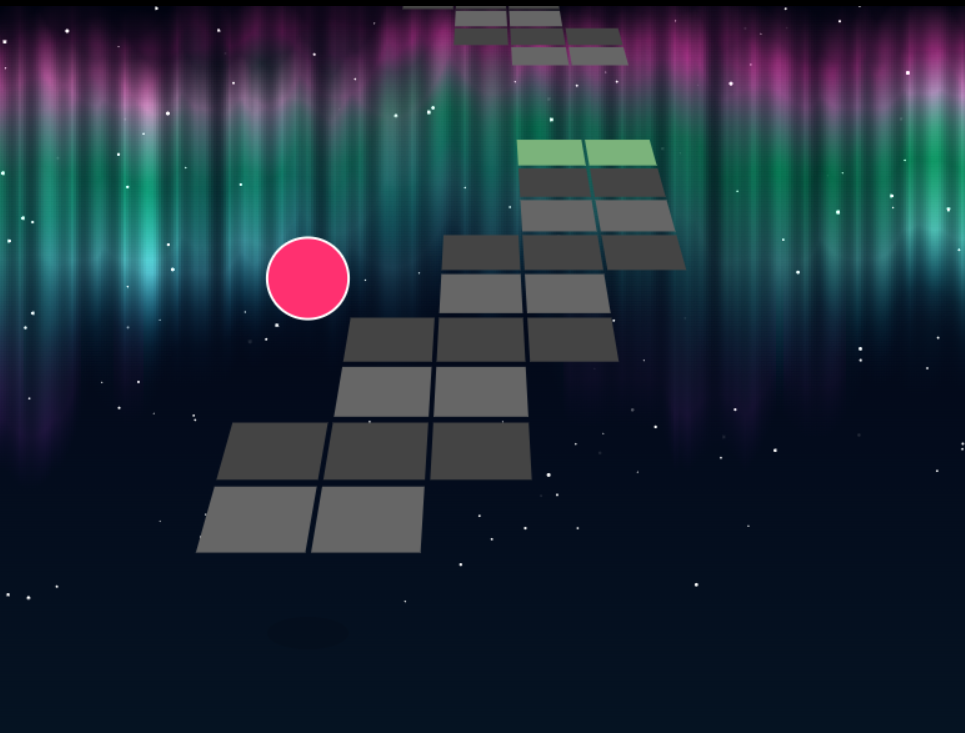

<table align="center" border="0" cellpadding="0" cellspacing="10">
    <tr>
        <td width="33%"></td>
        <td width="33%"></td>
        <td width="33%"></td>
    </tr>
    <tr>
        <td>Home</td>
        <td>Menu</td>
        <td>Game</td>
    </tr>
</table>

<h1 align="center"><b><font size="18">
    <a href="https://klhrd.github.io/ah-roll-rah/">
        AH-ROLL-RAH
    </a>
</font></b></h1>

<p align="center">
    
    
    <br>
    
    
    
    
    
    
</p>

An action-packed 3D ball-rolling platformer where you steer a high-speed ball through narrow, suspended tracks to reach the finish line. This project was originally created for **Tagless**, a Hack Club event.

---

## Project Architecture

```text
*/
├── js/
│   ├── scenes/
│   │   ├── gameScene.js
│   │   ├── homeScene.js
│   │   ├── infoScene.js
│   │   ├── menuScene.js
│   │   └── resultScene.js
│   │   
│   ├── app.js
│   ├── auroraBackground.js
│   ├── config.js
│   ├── levelManager.js
│   ├── progressManager.js
│   └── router.js
│
├── levels/
│   ├── build_index_json.py
│   ├── build_levels.py
│   ├── index.js
│   ├── level_1.json...
│
├── index.html
└── README.md

```

## Getting Started

You can run this project in two ways:

1. Direct Link
    - [Github Page](https://klhrd.github.io/ah-roll-rah/)
2. Run Locally
    -  Clone or download the repository, then host it using a local development server (like VS Code's Live Server) to run it locally via ES6 modules.
